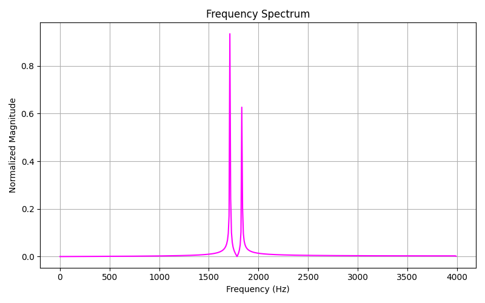

# 🎧 Signal Classifier using FFT & Machine Learning  
*A hybrid DSP + AI project built in Python*

---

## 🧩 Overview

This project demonstrates how **Digital Signal Processing (DSP)** techniques, specifically the **Fast Fourier Transform (FFT)** — can be combined with **Machine Learning (ML)** to classify different types of signals.

The goal:  
👉 Convert raw **time-domain signals** (like sine or square waves) into the **frequency domain**, extract numerical features and train an ML model to recognize signal types automatically.

This project bridges **Electronic Engineering**, **Data Science** and **AI** showing the practical integration of **Signal analysis with machine learning workflows**.

---

## 🚀 Key Features

| Category | Description |
|-----------|-------------|
| 🎛 **Signal Generation** | Creates synthetic signals (sine, square, and composite) with customizable frequencies and amplitudes |
| ⚡ **FFT Transformation** | Converts time-domain signals into frequency-domain representations using the Fast Fourier Transform |
| 🧠 **Feature Extraction** | Captures magnitude spectrum data for ML input |
| 🤖 **Machine Learning Model** | Uses scikit-learn’s `RandomForestClassifier` or `SVM` to classify signals |
| 📊 **Data Visualization** | Displays frequency spectra, time-domain plots, and phase relationships |
| 💾 **Modular Pipeline** | Organized into reusable Python scripts for clarity and maintainability |

---

## 🧱 Project Structure

SignalClassifierFFTML/
├── src/
│ ├── generate_signals.py
│ ├── extract_fft_features.py
│ ├── train_classifier.py
│ └── visualize_results.py
│
├── data/
│ ├── signals.npy
│ └── labels.npy
│
├── models/
│ └── signal_model.pkl
│
├── plots/
│ ├── time_domain.png
│ ├── time_domain_phase.png
│ ├── frequency_spectrum.png
│ ├── frequency_zoomed.png
│ └── fft_examples.png
│
├── requirements.txt
├── LICENSE
└── README.md
